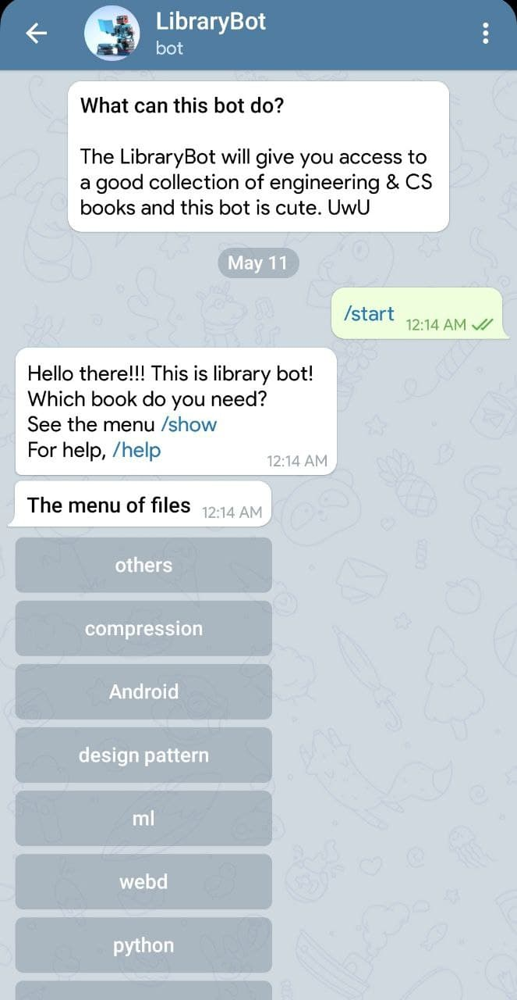
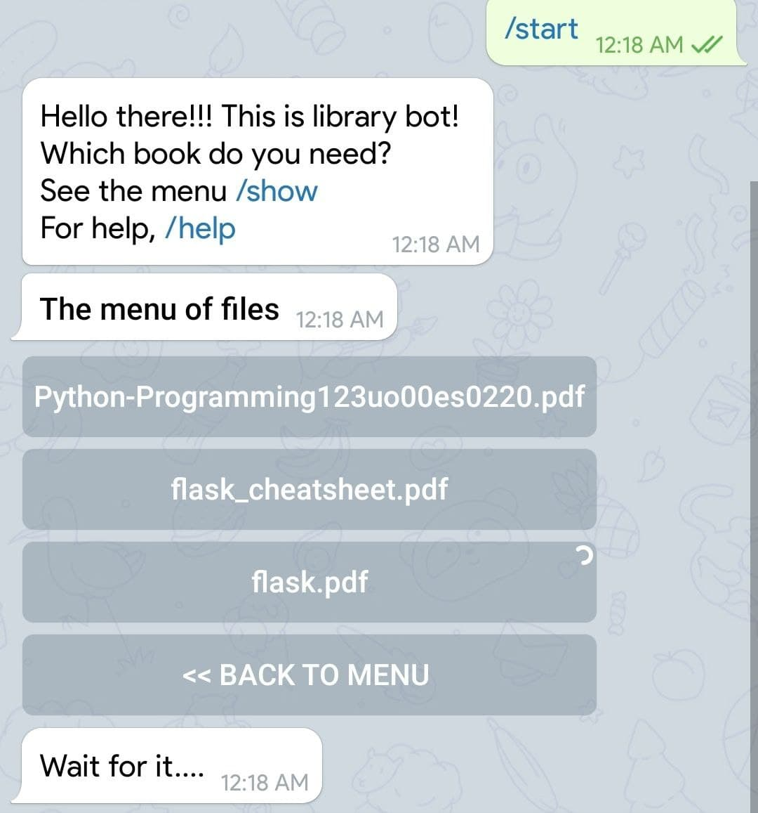
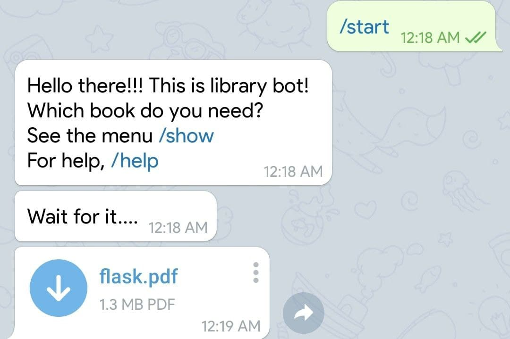
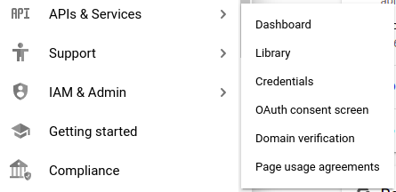

# LibraryBot

## About
This is a telegram bot that will give you access to a good collection of engineering & CS books stored in google drive. I used [telegrafjs](https://telegraf.js.org/) & `google-drive-api` to access the files of google drive. 

### Contents of root directory


### Downloading a file
After you click one file, it'll send you a text while downloading it from google drive

After sending you the file, the bot will delete the previous menu.

## Limitation
- This bot will not show files larger than 50 mb size. As per telegram api documentation, your bot can not send document files grater than 50 mb size. 

## How to customize this bot
You can customize this source code & make your own bot that will show files of your drive & you can download it via the bot.   

- ### Create a telegram bot
    You can see [this](../telegram%20bot/README.md) 
- ### Getting google drive api credentials
    - Go to https://console.cloud.google.com/
    - Create a project
    - Enable google drive api from `api library`    
    
    - Go [here](https://console.cloud.google.com/apis/api/drive.googleapis.com) to create a credentials
    - Download the credentials.json file & add the here.
- ### Get the root folder id 
    Get the folder id which folder will be the root folder, your bot will show. To get the folder id, open the folder in your browser. Now check the url of that page. You'll find your folder id.
    ```
    https://drive.google.com/drive/u/0/folders/{FOLDER_ID}
    ```  
- ### Create a .env file
    Create a `.env` file like this
    ```
    TOKEN=YOUR_TELEGRAM_BOT_TOKEN
    FOLDER_ID=ROT_FOLDER_ID
    ```
## Deploy
You can deploy this bot anywhere. You can deploy on [heroku](https://heroku.com) or any cloud platform. If you planning to deploy using docker, [docker-compose.yaml](docker-compose.yaml) config file is ready. Just run 
```
sudo docker-compose up --build -d
```