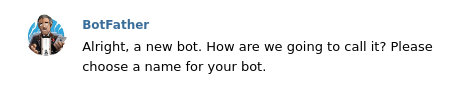

# Let's make a telegram bot 

To make a bot, we have to call the BotFather. 

At first, log in to your telegram account in your desktop telegram app or telegram web. After you are logged in, search `@botfather`. You'll see this


Now, 
- click `start` button.

- type `/newbot`    

- choose a name for your bot    

- choose a username for your bot    


    Save this token. 
 
Now, search for your bot with  `@BOT_USERNAME` and click the start button.

## Configure the bot

Now, configure your telegram bot. Here, I used nodejs and `node-telegram-bot-api` module to connect with my bot.

To connect with your bot.

``` javascript
const telegramBot = require('node-telegram-bot-api');

const token = process.env.TOKEN

const api = new telegramBot(token, {
    polling: true
});
```

You can setup reply for any command. Such as , for `\start ` command.
```javascript
api.onText(/\/start/, (msg, match) => {
    const fromId = msg.from.id;
    const welcomeMessage="";
    api.sendMessage(fromId, welcomeMessage);
});
```
This is the basic format of configuring your telegram bot. 

Here I implemented a basic sentiment analyzer. This bot will respond according to your text. If the value of the analyzer is positive, it'll send smiley emoji, if negative then upset emoji & neutral emoji if 0. If no text messages are sent, it'll send 🥺 this emoji. UwU   
## Flow of analysis
- converting contractions (e.g., I’m, you’re, etc.) to their standard lexicon. (i.e., I am, you are, etc.)
- making all characters lowercase.
- Removing non-alphabetical and special characters
- Tokenizing, splitting a text into its meaningful units.
- Analyzing sentiment with the [natural](https://github.com/NaturalNode/natural) library.   
## Here's the bot.

