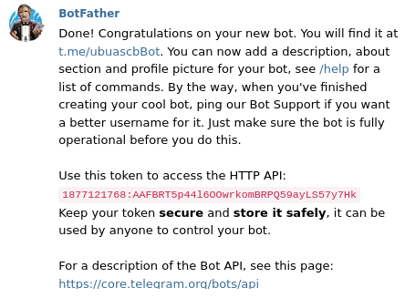

# Let's make a telegram bot 

To make a bot, we have to call the BotFather. 

At first, log in to your telegram account in your desktop telegram app or telegram web. After you are logged in, search `@botfather` . You'll see this


Now, 
- click `start` button.

- type `/newbot`    

- choose a name for your bot    

- choose a username for your bot    


    Save this token. 
 
Now, search for your bot with  `@BOT_USERNAME` and click start button.

## Configure the bot

Now, configure your telegram bot. Here, i used nodejs and `node-telegram-bot-api` module to connect with my bot.

To connect with your bot.

``` javascript
const telegramBot = require('node-telegram-bot-api');

const token = process.env.TOKEN

const api = new telegramBot(token, {
    polling: true
});
```

You can setup reply for any command. Such as , for `\start ` command.
```javascript
api.onText(/\/start/, (msg, match) => {
    const fromId = msg.from.id;
    const welcomeMessage="";
    api.sendMessage(fromId, welcomeMessage);
});
```
This is the basic format of configure your telegram bot. 

Here I implemented a basic sentiment analyzer. This bot will respond according to your text.
Here's an example.
